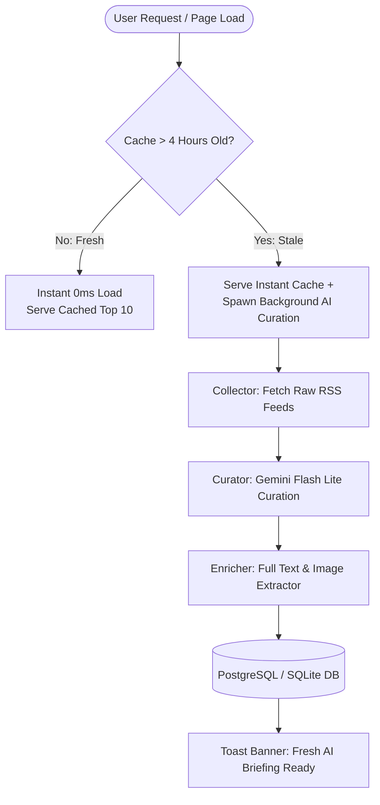

# Tech Pulse — Next-Gen Executive Tech Magazine (v5.0-lite)

**Tech Pulse** (`morning-brief`) is an AI-curated executive technology magazine designed for software engineers, tech leaders, and innovators. It fetches raw RSS feeds across 20+ top tech sources, deduplicates story clusters, selects the Top 10 most impactful tech headlines per domain, ranks them by relevance, and extracts full in-app article text with AI Executive Digests.

---

## Key Features (v5.0-lite)

- **On-Demand Stale-Cache Curation Engine**:
  - Serves cached Top 10 briefings instantly (0ms delay).
  - Automatically triggers background AI curation only when a user visits the app AND the cache is > 4 hours old.
  - Zero background timer execution — 0 API tokens spent overnight or during idle periods.
- **Gemini Flash Lite AI Engine**:
  - Uses `gemini-flash-lite-latest` for ultra-low-cost, high-speed story deduplication and rank scoring.
  - Reduces token expenditure by ~95% compared to baseline configurations.
- **Top 10 Impact Ranking & Hero Cards**:
  - Highlights Rank #1 as an executive Hero Card featuring a `Why it matters` callout badge.
  - Ranks #2 through #10 display clean rank badges, source metadata, and AI impact summaries.
- **Full In-App Article Reading**:
  - Multi-tier full-text extraction (`trafilatura` + `BeautifulSoup` fallback) rendering complete, clean article text inside the app.
- **Responsive Touch Navigation Ribbon**:
  - Smooth touch-scrollable navigation bar on mobile and tablet screens with automatic active tab centering.
- **Live Status & Reload Toast Banner**:
  - Real-time status indicator (`✦ Updating AI Briefing...`) and automatic reload toast banner when fresh AI curation completes.

---

## Magazine Categories

1. **All Tech (`all`)**: Master Overall Top 10 Headlines across all technology sectors.
2. **AI & ML (`ai_ml`)**: TechCrunch AI, VentureBeat AI, MIT Tech Review, Import AI, Ars Technica AI.
3. **Robotics (`robotics`)**: IEEE Spectrum Robotics, TechCrunch Robotics, Robohub, Import AI Robotics.
4. **EV & Mobility (`vehicles`)**: Electrek, InsideEVs, Ars Technica Cars.
5. **Hardware & Dev (`dev_hardware`)**: The Verge, Wired, TechCrunch, Tom's Hardware, Engadget, Hacker News.

---

## System Architecture



---

## Environment & Secrets

- `GEMINI_API_KEY`: API Key for Google Gemini (`gemini-flash-lite-latest`).
- `DATABASE_URL`: PostgreSQL connection URL (or local SQLite fallback `news.db`).

---

## Local Development

```bash
# Install dependencies
pip install -r requirements.txt

# Run Flask web app
python app.py
```

Access locally at `http://127.0.0.1:8009/`.

---

## Docker Production Deployment

```bash
docker compose up -d --build
```

- Port: `8009`
- Container Name: `news`
- Domain: `https://news.mybrain.world`
